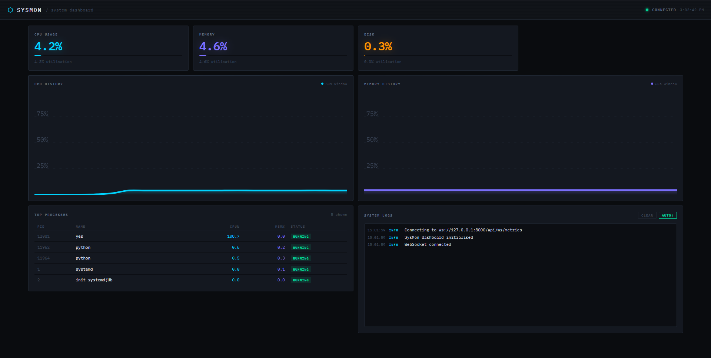

# System Monitoring Dashboard

A full-stack system monitoring application that tracks real-time metrics across one or more machines. Built with FastAPI and vanilla JavaScript.



## What This Is

A progressively complex project that went from a simple REST polling setup to a distributed monitoring system with WebSocket support.

**Three versions:**
- **v1** – Basic REST API with HTTP polling
- **v2** – WebSocket for real-time updates
- **v3** – Multi-machine monitoring with lightweight agents

Shows CPU, memory, disk, and process info in a live dashboard.

## Features

- Real-time system metrics (CPU, memory, disk, processes)
- Multi-machine support via agent-based collection
- WebSocket streaming for live updates
- REST API for metric queries
- Threshold-based alerting
- Custom SVG charts
- Simple logs panel

## Tech Stack

**Backend:** Python 3.10+, FastAPI, psutil, Uvicorn

**Frontend:** HTML5, CSS3, vanilla JavaScript, WebSocket API

**Environment:** Linux / WSL2

## Architecture

### v1 – HTTP Polling
```
Browser → [HTTP GET polling] → FastAPI → psutil
```

### v2 – WebSocket
```
Browser ⇄ [WebSocket] ⇄ FastAPI → psutil
```

### v3 – Distributed Agents
```
Machine 1 Agent ─┐
Machine 2 Agent ├──→ FastAPI Server → Dashboard
Machine N Agent ─┘
```

Agents run on each monitored machine and POST metrics to a central server.

## API

### Endpoints
- `GET /api/cpu` – CPU usage
- `GET /api/memory` – Memory usage
- `GET /api/disk` – Disk usage
- `GET /api/processes` – Top processes by resource use
- `GET /agents` – List connected machines
- `POST /ingest` – Agents submit metrics here
- `WS /api/ws/metrics` – Real-time metric stream

## Setup

**Requirements:** Python 3.10+, pip

```bash
git clone <repo>
cd system-monitor
python -m venv .venv
source .venv/bin/activate
pip install -r requirements.txt
```

## Running It

**Backend:**
```bash
cd backend
python -m uvicorn app.main:app --host 0.0.0.0 --port 8000
```

**Frontend:**
```bash
cd frontend
python -m http.server 5500
```

Then open `http://localhost:5500`

## Multi-Machine Setup

On each remote machine:

```bash
pip install psutil requests
```

Edit `agent.py` and set:
```python
SERVER = "http://your-server-ip:8000/ingest"
```

Run it:
```bash
python agent.py
```

## Design Notes

Started with polling to keep things simple. Switched to WebSockets for cleaner real-time updates. Added agents to handle multiple machines without overcomplicating the core server.

No persistence layer—this is monitoring, not archiving. Each machine reports independently. No auth yet (dev only).

## Limitations

- No authentication
- No persistent storage
- Dev server only
- Single-network deployment
- Basic alerting (threshold checks)

## Status

- v1 – Done
- v2 – Done
- v3 – Working

